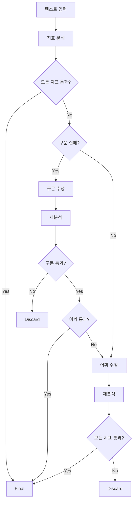

# Text Processing Pipeline API

텍스트 품질 검수 파이프라인 API - 구문/어휘 수정 자동화 시스템

## 개요

이 API는 텍스트의 구문적 복잡도와 어휘적 난이도를 자동으로 분석하고 수정하는 파이프라인을 제공합니다. 
외부 텍스트 분석기와 LLM을 활용하여 다음 기능을 수행합니다:

- 텍스트 지표 분석 (구문/어휘)
- 목표 지표에 맞는 구문 수정
- 목표 지표에 맞는 어휘 수정
- 배치 처리 지원

## 주요 기능

### 🔍 지표 분석
- **AVG_SENTENCE_LENGTH**: 평균 문장 길이
- **All_Embedded_Clauses_Ratio**: 내포절 비율
- **CEFR_NVJD_A1A2_lemma_ratio**: CEFR A1A2 어휘 비율

### 🔧 자동 수정
- **구문 수정**: 문장 길이 및 구문 복잡도 조정
- **어휘 수정**: 어휘 난이도 조정
- **최적 선택**: 여러 후보 중 최적 텍스트 선택

### 🚀 성능
- **병렬 처리**: 여러 지문 동시 처리
- **비동기 API**: 높은 처리량 지원

## 설치 및 실행

### 1. 의존성 설치
```bash
pip install -r requirements.txt
```

### 2. 환경 변수 설정
`.env` 파일을 생성하고 다음 내용을 설정:

```env
# 외부 API 설정
EXTERNAL_ANALYZER_API_URL=https://ils.jp.ngrok.io/api/enhanced_analyze

# OpenAI API 설정
OPENAI_API_KEY=your_openai_api_key_here
OPENAI_MODEL=gpt-4

# 서버 설정
DEBUG=True
LOG_LEVEL=INFO

# 파이프라인 설정
DEFAULT_SYNTAX_CANDIDATES=3
DEFAULT_LEXICAL_CANDIDATES=3
PIPELINE_TIMEOUT=300
```

### 3. 서버 실행
```bash
python main.py
```

또는

```bash
uvicorn main:app --host 0.0.0.0 --port 8000 --reload
```

## API 사용법

### 📝 배치 파이프라인 실행

**엔드포인트**: `POST /pipeline/run-batch`

**요청 예시**:
```json
{
  "items": [
    {
      "client_id": "row_12",
      "original_text": "원문 A",
      "title": "Story A",
      "generated_passage": "검수대상 A",
      "include_syntax": true,
      "master": {
        "AVG_SENTENCE_LENGTH": 12.3,
        "All_Embedded_Clauses_Ratio": 0.18,
        "CEFR_NVJD_A1A2_lemma_ratio": 0.46
      },
      "tolerance_abs": {"AVG_SENTENCE_LENGTH": 1.97},
      "tolerance_ratio": {
        "All_Embedded_Clauses_Ratio": 0.202,
        "CEFR_NVJD_A1A2_lemma_ratio": 0.104
      },
      "syntax_candidates": 3,
      "lexical_candidates": 3
    }
  ]
}
```

**응답 예시**:
```json
{
  "results": [
    {
      "client_id": "row_12",
      "status": "final",
      "syntax_pass": "PASS",
      "lexical_pass": "PASS",
      "detailed_result": "AVG_SENTENCE_LENGTH: 10.470 vs [6.620 ~ 11.080] → Pass\nCEFR_NVJD_A1A2_lemma_ratio: 0.571 vs [0.515 ~ 0.651] → Pass",
      "final_text": "최종 텍스트 A",
      "attempts": {"syntax": 1, "lexical": 1},
      "trace": []
    }
  ]
}
```

### 🔍 텍스트 분석

**엔드포인트**: `POST /analyze`

**요청 예시**:
```json
{
  "text": "분석할 텍스트",
  "auto_sentence_split": true,
  "include_syntax_analysis": true
}
```

## 처리 플로우



## 프로젝트 구조

```
api_server/
├── main.py                     # FastAPI 앱 진입점
├── requirements.txt            # 의존성 관리
├── config/
│   ├── settings.py            # 설정 관리
│   └── prompts.py             # LLM 프롬프트
├── api/
│   ├── pipeline.py            # 배치 파이프라인 엔드포인트
│   └── analyzer.py            # 분석기 프록시
├── core/
│   ├── pipeline.py            # 메인 파이프라인 로직
│   ├── analyzer.py            # 외부 분석기 API 클라이언트
│   ├── metrics.py             # 지표 추출 및 평가
│   ├── judge.py               # Pass/Fail 판단
│   └── llm/
│       ├── client.py          # OpenAI API 클라이언트
│       ├── syntax_fixer.py    # 구문 수정
│       ├── lexical_fixer.py   # 어휘 수정
│       └── selector.py        # 최적 선택
├── models/
│   ├── request.py             # API 요청 모델
│   ├── response.py            # API 응답 모델
│   └── internal.py            # 내부 데이터 모델
└── utils/
    ├── logging.py             # 로깅 설정
    ├── exceptions.py          # 커스텀 예외
    └── helpers.py             # 유틸리티 함수
```

## 상태 코드

### 처리 상태 (status)
- `final`: 성공적으로 완료
- `syntax_fail`: 구문 수정 실패
- `lexical_fail`: 어휘 수정 실패
- `error`: 시스템 오류

### 지표 통과 여부 (syntax_pass, lexical_pass)
- `PASS`: 지표 통과
- `FAIL`: 지표 실패

## 개발 정보

- **FastAPI**: 비동기 웹 프레임워크
- **Pydantic**: 데이터 검증 및 직렬화
- **OpenAI API**: LLM 텍스트 생성
- **aiohttp**: 비동기 HTTP 클라이언트

## API 문서

서버 실행 후 다음 URL에서 자동 생성된 API 문서를 확인할 수 있습니다:
- Swagger UI: `http://localhost:8000/docs`
- ReDoc: `http://localhost:8000/redoc`

## 상태 확인

**엔드포인트**: `GET /health`

서비스 상태와 설정 정보를 확인할 수 있습니다. 