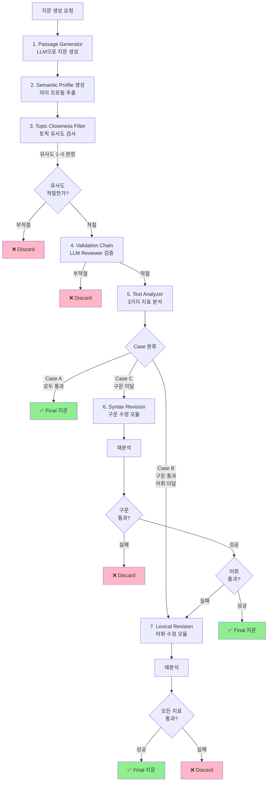
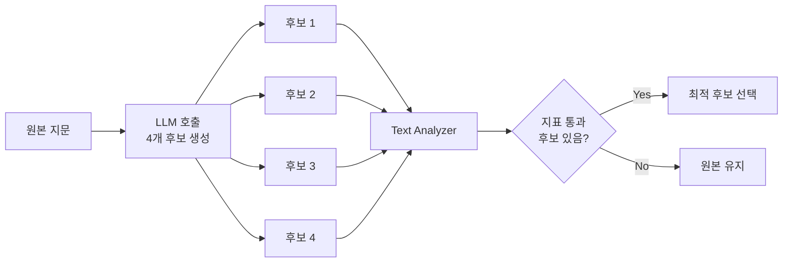
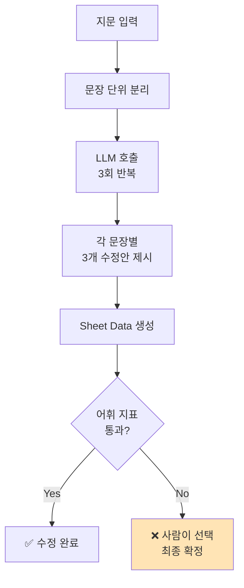
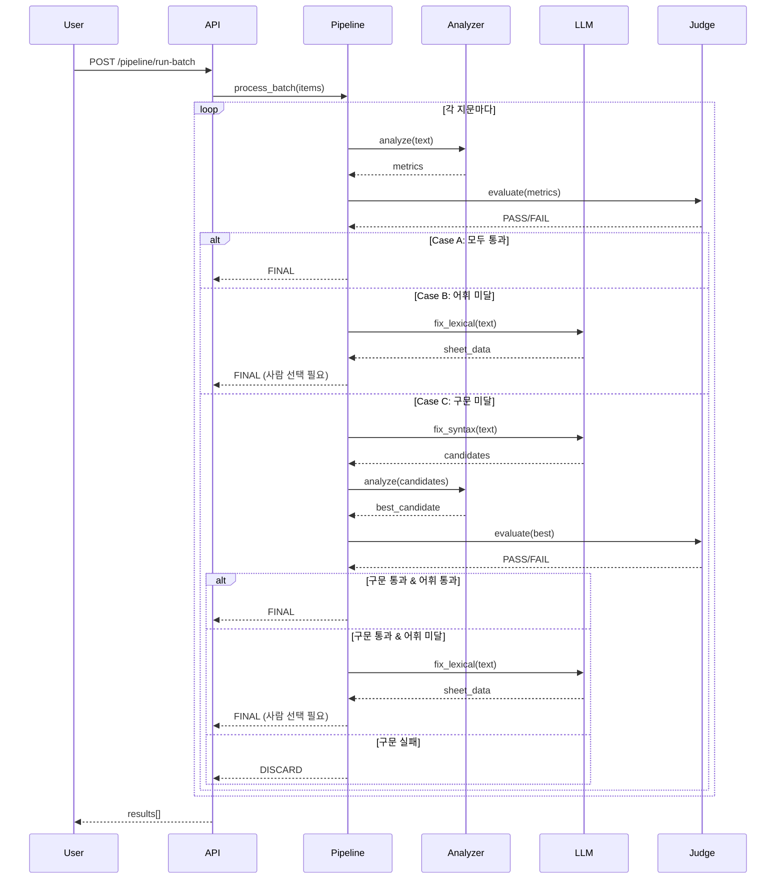

# TFT Passage Generation Pipeline - 전체 프로세스 개요

> **목적**: 이 문서는 TFT 영어 지문 생성 및 검수 파이프라인(Batch 3 Process)의 전체 워크플로우를 처음 접하는 사람도 이해할 수 있도록 설명합니다.

---

## 📋 목차

1. [시스템 개요](#-시스템-개요)
2. [전체 프로세스 플로우](#-전체-프로세스-플로우)
3. [단계별 상세 설명](#-단계별-상세-설명)
4. [핵심 컴포넌트](#-핵심-컴포넌트)
5. [기술 스택](#-기술-스택)

---

## 🎯 시스템 개요

### 무엇을 하는 시스템인가?

이 시스템은 **교육용 영어 지문(Reading Passage)**을 자동으로 생성하고, 품질을 검증하며, 필요시 자동으로 수정하는 파이프라인입니다.

### 핵심 목표

- **구문적 복잡도(Syntax)**: 문장 길이와 내포절 비율을 목표 범위 내로 조정
- **어휘적 난이도(Vocabulary)**: CEFR 기준 어휘 레벨을 목표 범위 내로 조정
- **토픽 유사도(Topic Closeness)**: 원본 교재와 적절한 거리를 유지 (너무 가깝지도, 멀지도 않게)

### 측정하는 3가지 핵심 지표

| 지표 | 설명 | 예시 |
|------|------|------|
| **AVG_SENTENCE_LENGTH** | 평균 문장 길이 (단어 수) | 목표: 12.3 ± 1.97 |
| **All_Embedded_Clauses_Ratio** | 내포절 비율 (구문 복잡도) | 목표: 0.18 ± 0.202 |
| **CEFR_NVJD_A1A2_lemma_ratio** | A1/A2 레벨 어휘 비율 | 목표: 0.46 ± 0.104 |

---

## 🔄 전체 프로세스 플로우



---

## 📖 단계별 상세 설명

### 1️⃣ Passage Generator (지문 생성)

**역할**: LLM을 사용하여 교육용 영어 지문을 생성합니다.

**입력 파라미터**:
- 학습자 타입 (learner_type)
- 목표 읽기 스킬 (target_reading_skill)
- 단어 수 (word_count)
- 장르, 톤, 스타일
- 구문/어휘 난이도 가이드라인
- 금지 토픽 목록 (topic_prohibition)
- 원본 교재의 의미 프로필 (semantic_profile)
- 토픽 유사도 제약 조건

**출력**:
```json
{
  "title": "지문 제목",
  "passage": "생성된 지문 본문",
  "topic": "주제 요약 (ProperNoun1, ProperNoun2, ProperNoun3)"
}
```

**사용 모델**: GPT-4o-latest, Claude Sonnet 4, Gemini 2.0 Flash

**핵심 로직**:
- 원본 교재의 구문/어휘 난이도를 유지하면서 새로운 지문 생성
- 금지된 고유명사나 토픽을 피하고 새로운 내용 창작
- ATOS 값을 원본과 동일하게 유지

---

### 2️⃣ Semantic Profile Generator (의미 프로필 생성)

**역할**: 생성된 지문의 의미적 특성을 구조화된 프로필로 추출합니다.

**2단계 프로세스**:

#### Phase 1: 기본 프로필 생성
LLM(GPT-4.1)을 사용하여 다음 항목을 추출:

```python
{
  "discipline": "People, Society & Culture",  # 6개 대분류 중 선택
  "subtopic_1": "Animals",  # 세부 주제 분류
  "central_focus": ["landforms", "temperature zones", "wildlife"],  # 핵심 섹션
  "key_concepts": ["proper nouns", "dates", "key terms"],  # 고유명사/핵심 용어
  "processes_structures": "설명 구조 (예: hook-body-conclusion)",
  "setting_context": "시간/장소/배경",
  "purpose_objective": "explain/describe/entertain/compare/argue",
  "genre_form": "expository/narrative/procedural/argumentative"
}
```

#### Phase 2: Subtopic_2 생성
AR Category 데이터를 참조하여 더 세밀한 하위 주제를 분류:

```yaml
Animals:
  - African Animals
  - Alligators
  - Amphibians
  - Bears
  - Birds
  # ... (300+ 옵션)
```

**구현 위치**: `core/services/semantic_profile.py`

---

### 3️⃣ Topic Closeness Filter (토픽 유사도 필터)

**역할**: 생성된 지문이 원본 교재와 적절한 거리를 유지하는지 평가합니다.

**평가 프로세스**:

1. **원본 프로필**과 **생성된 프로필**을 LLM에 전달
2. LLM이 8개 항목에 대해 점수 부여:
   - `discipline_match`: 대분류 일치도
   - `subtopic_match`: 세부 주제 일치도
   - `central_focus_match`: 핵심 초점 유사도
   - `key_concept_overlap`: 핵심 개념 중복도
   - `process_parallel`: 구조 유사도
   - `setting_alignment`: 배경 일치도
   - `purpose_alignment`: 목적 일치도
   - `genre_alignment`: 장르 일치도
   - `penalties`: 감점 항목

3. **Total Points 계산** 및 **라벨 매핑**:

| Total Points | Closeness Label | 의미 |
|--------------|-----------------|------|
| 13+ | 5 | 너무 유사함 (부적절) |
| 10~12 | 4 | 상당히 유사함 |
| 7~9 | 3 | 적절한 유사도 ✅ |
| 4~6 | 2 | 약간 유사함 |
| 0~3 | 1 | 거의 다름 (부적절) |

**구현 위치**: `core/services/topic_closeness.py`

---

### 4️⃣ Validation Chain (LLM Reviewer)

**역할**: LLM을 사용하여 지문의 적절성을 최종 검증합니다.

**검증 항목**:
- 부적절한 내용 포함 여부
- 교육 목적에 부합하는지
- 학습자 레벨에 적합한지

> 이 단계는 PDF에 명시되어 있으나, 현재 코드베이스에서는 명시적으로 구현되지 않은 것으로 보입니다.

---

### 5️⃣ Text Analyzer (텍스트 분석기)

**역할**: 외부 API를 호출하여 지문의 구문/어휘 지표를 정량적으로 분석합니다.

**분석 지표**:

```python
{
  "AVG_SENTENCE_LENGTH": 12.47,  # 평균 문장 길이
  "All_Embedded_Clauses_Ratio": 0.215,  # 내포절 비율
  "CEFR_NVJD_A1A2_lemma_ratio": 0.523  # A1/A2 어휘 비율
}
```

**구현 위치**: `core/analyzer.py`

**외부 API 엔드포인트**: 
```
POST https://ils.jp.ngrok.io/api/enhanced_analyze
```

**요청 형식**:
```json
{
  "text": "분석할 지문",
  "auto_sentence_split": true,
  "include_syntax_analysis": true
}
```

---

### 6️⃣ Metrics Judge (지표 판정)

**역할**: 분석된 지표를 마스터 기준과 비교하여 Pass/Fail을 판단합니다.

**판정 로직**:

```python
# 구문 지표 평가
AVG_SENTENCE_LENGTH: master ± tolerance_abs
All_Embedded_Clauses_Ratio: master ± tolerance_ratio

# 어휘 지표 평가
CEFR_NVJD_A1A2_lemma_ratio: master ± tolerance_ratio
```

**예시**:
```
Master: AVG_SENTENCE_LENGTH = 12.3
Tolerance_abs = 1.97
→ 허용 범위: [10.33 ~ 14.27]

현재값: 12.47
→ PASS ✅
```

**3가지 Case 분류**:

| Case | 구문 | 어휘 | 다음 단계 |
|------|------|------|-----------|
| **Case A** | ✅ PASS | ✅ PASS | 즉시 Final |
| **Case B** | ✅ PASS | ❌ FAIL | 어휘 수정 모듈 |
| **Case C** | ❌ FAIL | - | 구문 수정 모듈 |

**구현 위치**: `core/judge.py`

---

### 7️⃣ Syntax Revision Module (구문 수정 모듈)

**역할**: 구문 지표가 목표 범위를 벗어난 경우, LLM을 사용하여 문장 구조를 수정합니다.

**처리 프로세스**:



**LLM 프롬프트 전략**:

1. **현재 지표 분석**: 어떤 지표가 문제인지 파악
2. **수정 방향 결정**:
   - 문장 길이 증가/감소
   - 내포절 비율 증가/감소
3. **4개 후보 생성**: 다양한 온도(temperature) 설정으로 생성
4. **순차 분석**: 각 후보를 Text Analyzer로 분석
5. **최적 선택**: 목표 범위에 가장 가까운 후보 선택

**Temperature 설정**: `[0.2, 0.3]` (일관성과 다양성의 균형)

**구현 위치**: `core/llm/syntax_fixer.py`

**핵심 코드 로직**:
```python
async def fix_syntax_with_params(
    text: str,
    avg_target_min: float,
    avg_target_max: float,
    clause_target_min: float,
    clause_target_max: float,
    current_metrics: Dict[str, float],
    num_modifications: int,
    problematic_metric: str,
    prompt_type: str = "decrease"
):
    # 1. 프롬프트 생성
    prompt = prompt_builder.build_syntax_prompt(...)
    
    # 2. LLM으로 4개 후보 생성
    candidates = await llm_client.generate_candidates(prompt, n=4)
    
    # 3. 순차적으로 분석하여 통과한 후보 찾기
    for candidate in candidates:
        metrics = await analyzer.analyze(candidate)
        if is_within_range(metrics):
            return candidate
    
    # 4. 통과한 후보 없으면 원본 유지
    return text
```

---

### 8️⃣ Lexical Revision Module (어휘 수정 모듈)

**역할**: 어휘 지표가 목표 범위를 벗어난 경우, 문장별로 어휘를 수정합니다.

**처리 프로세스**:



**Sheet Data 구조**:

```json
{
  "revision_summary": "전체 수정 요약",
  "sheet_data": [
    {
      "st_id": 1,
      "original_sentence": "원본 문장",
      "corrections": [
        {
          "original_clause": "difficult vocabulary",
          "revised_clause": "hard words",
          "is_ok": true
        },
        {
          "original_clause": "difficult vocabulary",
          "revised_clause": "challenging terms",
          "is_ok": true
        },
        {
          "original_clause": "difficult vocabulary",
          "revised_clause": "tough language",
          "is_ok": true
        }
      ]
    }
  ]
}
```

**LLM 호출 전략**:
- **3회 호출**: 각 호출마다 문장별로 3개의 수정안 제시
- **Temperature**: `0.2` (일관성 중시)
- **중복 제거**: 동일한 수정안은 자동으로 제거

**사람의 개입**:
> 어휘 수정은 구문 수정과 달리 **사람이 최종 선택**합니다. LLM이 제안한 여러 어휘 중에서 가장 적절한 것을 선택하여 Final 지문을 완성합니다.

**구현 위치**: `core/llm/lexical_fixer.py`

**핵심 코드 로직**:
```python
async def fix_lexical_with_params(
    text: str,
    master: MasterMetrics,
    tolerance_ratio: ToleranceRatio,
    current_cefr_ratio: float,
    direction: str = "increase"
):
    # 1. 프롬프트 생성
    prompt = prompt_builder.build_lexical_prompt(...)
    
    # 2. LLM으로 3회 호출하여 수정안 생성
    all_sheet_data = []
    for i in range(3):
        candidate = await llm_client.generate_text(prompt)
        parsed = _parse_lexical_candidate_output(candidate)
        all_sheet_data.append(parsed['sheet_data'])
    
    # 3. 중복 제거 및 병합
    merged_sheet = _merge_sheet_data(all_sheet_data)
    
    # 4. 반환 (사람이 선택)
    return {
        "sheet_data": merged_sheet,
        "requires_human_selection": True
    }
```

---

## 🧩 핵심 컴포넌트

### Pipeline Processor (`core/pipeline.py`)

**역할**: 전체 파이프라인의 오케스트레이션을 담당합니다.

**주요 메서드**:

```python
class PipelineProcessor:
    async def run_pipeline(self, payload: PipelineItem) -> PipelineResult:
        """
        단일 지문에 대한 파이프라인 실행
        
        플로우:
        1. 초기 분석
        2. Case 분류 (A/B/C)
        3. 구문 수정 (필요시)
        4. 어휘 수정 (필요시)
        5. Final 또는 Discard 반환
        """
        
    async def _fix_syntax_step(...) -> tuple:
        """구문 수정 단계"""
        
    async def _fix_lexical_step(...) -> tuple:
        """어휘 수정 단계"""
```

**상태 코드**:

| Status | 의미 |
|--------|------|
| `FINAL` | 모든 지표 통과, 최종 지문 확정 ✅ |
| `SYNTAX_FAIL` | 구문 수정 실패로 폐기 ❌ |
| `LEXICAL_FAIL` | 어휘 수정 실패로 폐기 ❌ |
| `ERROR` | 시스템 오류 ⚠️ |

---

### Batch Processor

**역할**: 여러 지문을 병렬로 처리합니다.

```python
class BatchProcessor:
    async def process_batch(self, items: List[PipelineItem]) -> List[PipelineResult]:
        """
        병렬 처리로 성능 최적화
        - asyncio.gather 사용
        - 예외 처리 포함
        """
```

---

### LLM Client (`core/llm/client.py`)

**역할**: OpenAI API와의 통신을 담당합니다.

**주요 기능**:
- 텍스트 생성 (구문/어휘 수정)
- 구조화된 출력 (JSON Schema 사용)
- Temperature 조절
- 재시도 로직

---

### Prompt Builder (`core/llm/prompt_builder.py`)

**역할**: LLM 프롬프트를 동적으로 생성합니다.

**프롬프트 타입**:
- **Syntax Decrease**: 문장 길이/내포절 감소
- **Syntax Increase**: 문장 길이/내포절 증가
- **Lexical Increase**: 어휘 난이도 증가
- **Lexical Decrease**: 어휘 난이도 감소

---

## 🛠 기술 스택

### Backend Framework
- **FastAPI**: 비동기 웹 프레임워크
- **Pydantic**: 데이터 검증 및 직렬화
- **uvicorn**: ASGI 서버

### LLM Integration
- **OpenAI API**: GPT-4, GPT-4o
- **Anthropic Claude**: Claude Sonnet 4
- **Google Gemini**: Gemini 2.0 Flash

### Async Processing
- **asyncio**: 비동기 처리
- **aiohttp**: 비동기 HTTP 클라이언트

### External Services
- **Text Analyzer API**: 구문/어휘 지표 분석
- **Semantic Profile Generator**: 의미 프로필 추출

---

## 📊 데이터 플로우 요약



---

## 🎓 주요 개념 정리

### Tolerance (허용 오차)

**Absolute Tolerance (절대값 허용 오차)**:
- 문장 길이에 사용
- 예: `12.3 ± 1.97` → `[10.33 ~ 14.27]`

**Ratio Tolerance (비율 허용 오차)**:
- 내포절 비율, 어휘 비율에 사용
- 예: `0.18 ± 0.202` → `[-0.022 ~ 0.382]`

### Embedded Clauses (내포절)

문장 내에 포함된 종속절을 의미합니다.

**예시**:
```
Simple: "The cat sat on the mat."
Embedded: "The cat that I saw yesterday sat on the mat."
           └─────────────────┘ (관계절 내포)
```

### CEFR Levels

유럽 언어 공통 참조 기준 (Common European Framework of Reference):
- **A1/A2**: 초급 (Basic User)
- **B1/B2**: 중급 (Independent User)
- **C1/C2**: 고급 (Proficient User)

---

## 🔍 트러블슈팅 가이드

### 구문 수정이 계속 실패하는 경우

**원인**:
- Tolerance 범위가 너무 좁음
- LLM이 생성한 4개 후보 모두 범위 밖

**해결책**:
1. Tolerance 값 조정
2. `num_modifications` 증가
3. 다른 LLM 모델 시도

### 어휘 수정 후에도 지표가 통과하지 못하는 경우

**원인**:
- 수정 가능한 어휘가 부족
- 목표 비율이 현실적이지 않음

**해결책**:
1. 사람이 직접 더 많은 어휘 교체
2. Tolerance 범위 재검토
3. 지문 전체를 다시 생성

### API 타임아웃 발생

**원인**:
- LLM 응답 지연
- Text Analyzer API 응답 지연

**해결책**:
1. `PIPELINE_TIMEOUT` 값 증가 (기본 300초)
2. 배치 크기 줄이기
3. 재시도 로직 활용

---

## 📝 다음 단계

이 문서를 바탕으로 HTML 인터랙티브 문서를 만들 예정입니다. HTML 버전에는 다음 기능이 포함될 예정입니다:

- ✅ 인터랙티브 플로우차트 (클릭 가능)
- ✅ 각 단계별 상세 설명 토글
- ✅ 실제 데이터 예시 (JSON 뷰어)
- ✅ 코드 스니펫 하이라이팅
- ✅ 검색 기능
- ✅ 다크모드 지원

---

**문서 버전**: 1.0  
**최종 수정일**: 2026-01-26  
**작성자**: TFT API Server Team
